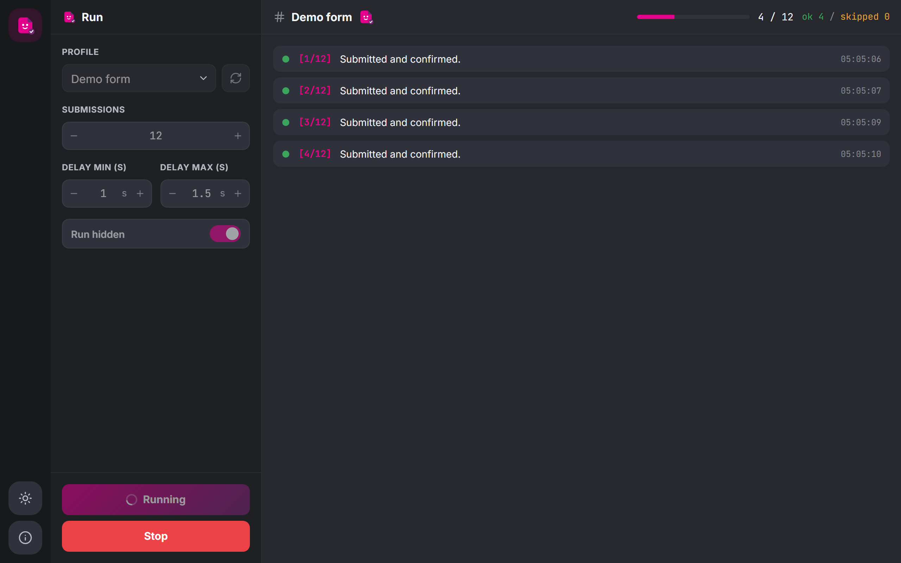

# Quorum

A small local web app that submits an online form over and over for you, with a live console so you can watch it go.

> Built for open, anonymous forms where the owner is fine with repeat submissions.
> Unofficial tool, not affiliated with any form provider.



## What it is

Some forms are meant to be spammed a little. Office polls, "drop a message" boards, that kind of thing. Submitting by hand gets old fast, so this automates it.

It's not hardcoded to one form. Each form gets a small profile file, and that's the only thing you ever edit:

- `submitter.py` is the engine. It opens chromium with Playwright, fills the form, clicks Submit, waits for the thank you text, sleeps a random delay, then repeats. It reports everything as events and checks a stop flag between rounds.
- `profiles/` holds one file per form: a `NAME`, a `URL`, and a `fill(page)` function.
- `server.py` is a small FastAPI app that runs the engine in a thread and streams its events to the page over SSE.
- `web/` is the UI. One static page, plain CSS and JS, no build step.

## Install

Needs Python 3.10+.

```powershell
pip install -r requirements.txt
playwright install chromium
```

## Run

```powershell
uvicorn server:app
```

Then open the localhost URL it prints, usually `http://127.0.0.1:8000`. On Windows you can also double-click `Quorum.bat`, which starts the server and opens the browser for you. Close its window to stop.

## Adding a form

1. Record yourself filling the form once:

   ```powershell
   playwright codegen "https://your-form-host.example/your-form-id"
   ```

2. Copy `profiles/example_form.py`, set `NAME` and `URL`, and paste the recorded `page.*` lines into `fill(page)`. Skip the `page.goto(...)` line and the final Submit click, the engine handles those.
3. Randomize at least one text answer (the example shows how) so the submissions aren't all identical.
4. Hit Reload next to the profile dropdown.

Heads up: `.gitignore` ignores everything in `profiles/` except the example, so your own form URLs don't end up in the repo.

## The UI

- **Profile** picks the form. Reload re-scans the folder.
- **Submissions** is how many times to submit. Default 10.
- **Delay min/max** sets the random pause between submissions, default 2 to 6 seconds.
- **Run hidden** runs the browser headless. Turn it off if you want to watch chromium fill the form, which is honestly the fun part.
- **Start / Stop**. Stop finishes the submission it's on, then quits.

Dark mode by default, toggle in the left rail. Works fine with keyboard only and respects reduced motion settings.

## Please be reasonable

- Automating submissions is usually against a form host's terms of service, and if you go too fast you'll get rate-limited or temporarily blocked anyway. Keep the counts low and the delays generous.
- If a form is set to one response per person or has a CAPTCHA, it will bounce. That's the owner telling you they don't want this. Listen to them.
- There's no CAPTCHA solving, proxy rotation, or any anti-bot tricks in here, and there never will be.

## License

[MIT](LICENSE)
